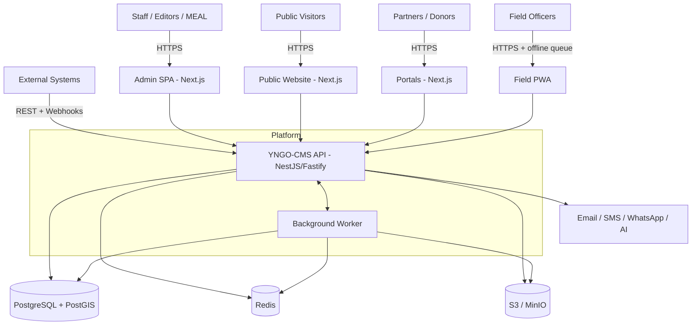
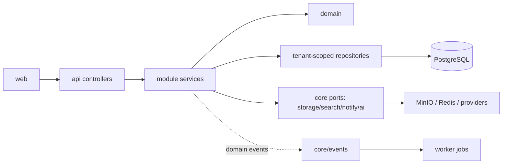

# ARCHITECTURE.md — YNGO-CMS / YemenNGO-CMS

> **Status:** TARGET ARCHITECTURE (approved for Phase 0 foundation)
> **Owner:** Lead Architect | **Last Updated:** 2026-10-02
> **Source of truth:** this file for system design; see `TECHNICAL_DECISIONS.md`
> for rationale and `docs/03-architecture/` for detail.
> **Constraint:** implementation MUST NOT bypass this document. Changes require an ADR.

---

## 1. System Overview

YNGO-CMS is a **modular monolith** with an **API-first** boundary, delivering a
professional CMS plus NGO operational modules on one multi-tenant platform.

```text
Consumers          Platform (one deployable API)                Infrastructure
─────────          ───────────────────────────                 ──────────────
Admin SPA     ─┐
Public Site   ─┤   ┌──────────────────────────────┐             PostgreSQL
Partner Portal─┼──▶│  apps/api (NestJS + Fastify) │───┐         + PostGIS
Field PWA     ─┤   │  core + modules + common     │   │         Redis
Mobile/BI     ─┤   └──────────────────────────────┘   ├────────▶ S3 / MinIO
External APIs ─┘              │                        │         Reverse Proxy
                              ▼                        │         Workers
                        apps/worker (jobs)  ───────────┘
```

**Non-negotiables** (inherited from frozen specs): API-first; multi-tenant from
day one; Arabic-first RTL; secure by default; permission-aware at every layer;
configuration over hard-coding; modularity; auditability; no mock business data;
no hard-coded tenant logic; canonical transactional data in PostgreSQL.

---

## 2. Architecture Principles

| # | Principle | Concrete rule in this codebase |
|---|-----------|--------------------------------|
| P1 | Separation of Concerns | Controller → DTO → Service → Domain → Repository. Controllers stay thin. |
| P2 | Single Responsibility | One module per bounded context; one class per behaviour. |
| P3 | Dependency Inversion | Modules depend on interfaces (`StoragePort`, `SearchPort`, `AIProvider`, `NotifierPort`), not vendor SDKs. |
| P4 | Domain Boundaries | Cross-module access only via exported service interfaces or domain events — never by importing another module's repository. |
| P5 | Explicit Contracts | Every endpoint has typed DTOs + documented error codes. OpenAPI is generated, never hand-written. |
| P6 | Type Safety | TypeScript `strict` on both sides. Python (`mypy`) only for the optional AI sidecar. No `any` in domain code. |
| P7 | Observability | Every request carries `request_id`; every mutation emits an audit record; logs are structured JSON. |
| P8 | Security by Design | Deny-by-default guards; tenant context required on every data path; field-level policy for sensitive data. |
| P9 | Testability | Every module ships unit + integration tests; every security boundary ships a negative test. |
| P10 | Configuration over Hardcoding | No tenant ids, domains, credentials, or limits in source — env/config only. |
| P11 | Environment Separation | `dev` / `test` / `staging` / `prod` profiles; identical containers, different config. |
| P12 | Migration Safety | Append-only migrations, tested rollback, no destructive change without ADR + backup evidence. |

**Rejected anti-patterns:** microservices at v1; graph DB as canonical store;
Redis-as-database; object storage as database; domain model flattened into JSON
blobs; plugins that bypass tenant scope.

## 3. System Context (C4 Level 1)



---

## 4. Container Architecture (C4 Level 2)

| Container | Technology | Responsibility | Scaling |
|-----------|-----------|----------------|---------|
| `web` | Next.js + React + TS | Admin SPA, public site, portals (RSC + client components) | Horizontal (stateless) |
| `api` | NestJS + Fastify + TS | Business logic, authorization, tenant resolution, REST `/api/v1` | Horizontal (stateless) |
| `worker` | Node + BullMQ | Async: exports, renditions, notifications, webhooks, reports, automation | Horizontal |
| `postgres` | PostgreSQL + PostGIS | Canonical transactional store + geospatial + FTS | Vertical first; replicas later |
| `redis` | Redis | Cache, rate limits, queue backend, ephemeral coordination (NOT canonical) | Single / HA |
| `minio` | S3-compatible | Objects: media, documents, export artifacts, restricted attachments | External service |
| `proxy` | Caddy or Nginx | TLS termination, routing, compression, security headers | Active/passive |
| `ai` (optional) | FastAPI + Python | OCR, embeddings, summarisation — bounded, human-reviewed | Optional |

**Deployment invariant:** `api` and `worker` share one image and one domain
codebase; only the entrypoint differs. Critical state never lives only inside a
process.

---

## 5. Component / Module Architecture

Backend is organised by business capability with a strict three-tier discipline:

```text
apps/api/src/
├── main.ts                 # bootstrap, global pipes/filters/interceptors
├── app.module.ts           # composes core + enabled modules only
├── core/                   # cross-cutting: config, database, logging, errors,
│                           # health, events, security
├── common/                 # decorators, guards, interceptors, pipes, filters, utils
└── modules/                # one folder per bounded context
    ├── identity/ tenancy/ organizations/ users/ roles/ permissions/ audit/
    ├── cms/ media/ documents/ search/ notifications/
    ├── programs/ projects/ activities/ indicators/
    ├── grants/ donors/ partners/ stakeholders/
    ├── meal/ forms/ beneficiaries/ cases/ safeguarding/ feedback/
    ├── volunteers/ hr/ procurement/ finance/ assets/ fleet/ travel/
    ├── events/ tasks/ communications/ advocacy/ gis/ governance/ membership/
    ├── workflow/ automation/ reports/ dashboards/ analytics/
    └── integrations/ webhooks/ api-keys/ ai/ import-export/
```

### Module anatomy (uniform contract)

```text
modules/<context>/
├── <context>.module.ts        # Nest wiring; exports ONLY its public service
├── <context>.controller.ts    # HTTP boundary (thin)
├── dto/                       # validation DTOs (Zod-aligned at the edge)
├── <context>.service.ts       # application service / use-cases
├── domain/                    # entities, value objects, invariants, policies
├── repositories/              # data access (tenant-scoped)
├── events/                    # emitted / consumed domain events
├── policies/                  # authorization + field-level rules
└── <context>.spec.ts          # co-located tests
```

### Dependency rules (enforced)



- **Allowed:** module → `core`; module → `common`; module → its own layers.
- **Allowed with care:** module → another module's **exported service** or **event**.
- **Forbidden:** module → another module's repository/entity; `core` → any module;
  `common` → any module; frontend → database directly.

## 6. Domain Boundaries (Bounded Contexts)

| Context | Owns | Key entities | Depends on |
|---------|------|--------------|------------|
| **Tenancy** | Tenant context resolution, tenant lifecycle | Tenant, TenantSettings, TenantDomain | — (root) |
| **Identity** | AuthN, sessions, credentials, invitations | User, UserProfile, Session, Invitation, PasswordResetToken, MFAFactor, LoginEvent | Tenancy |
| **Access** | AuthZ: roles, permissions, groups, policies | Role, Permission, RolePermission, Group, GroupMember, UserRole, ApiKey, OAuthApplication | Identity, Tenancy |
| **Organization** | Org structure + profile | Organization, Department, Branch, Office, Team, Position, ContactPoint | Tenancy |
| **Governance** | Board/committees/policies | Board, BoardMember, Committee, BoardMeeting, BoardResolution, Policy | Organization |
| **CMS** | Content lifecycle + publishing | Content, Page, Article, News, Story, Publication, FAQ, Campaign, Vacancy, Tender, Event, Category, Tag | Organization, Media, Workflow |
| **Media/DAM** | Assets + renditions | MediaAsset, Rendition, Folder, Collection | Tenancy, Storage port |
| **Documents/DMS** | Documents, versions, retention | Document, DocumentVersion, DocumentCategory, RetentionPolicy | Media, Governance |
| **Programs** | Programs + activities | Program, Activity | Organization |
| **Projects** | Project lifecycle | Project, ProjectLocation, ProjectTeam, Milestone | Programs, Organization |
| **MEAL** | Results + measurement | Indicator, IndicatorValue, LogFrame, Assessment, Baseline, Evaluation | Projects |
| **Grants** | Funding lifecycle | Grant, GrantMilestone, GrantReport, Opportunity, Proposal | Donors, Projects |
| **Partners/Donors/CRM** | Relationships | Donor, Partner, Stakeholder, Contact, Interaction, CRMTask | Organization |
| **People** | Staff, volunteers, sensitive population | Staff, Volunteer, Beneficiary, Household, Enrollment, Case, Referral, SafeguardingCase, Complaint | Organization, Documents |
| **Operations** | Assets, fleet, travel, procurement, finance layer | Asset, Vehicle, Trip, TravelRequest, PurchaseRequest, RFQ, PurchaseOrder, Budget, CostCenter | Organization |
| **Workflow/Automation** | Definitions + execution engine | WorkflowDefinition, WorkflowInstance, Step, Transition, AutomationRule, ExecutionLog | core/events |
| **Reporting** | Reports, dashboards, analytics | ReportTemplate, ReportRun, Dashboard, Widget, SavedView | all read models |
| **GIS** | Spatial features | Location, Boundary, MapLayer, ProjectMap | Projects |
| **Platform** | Search, notifications, integrations, webhooks, API keys, audit, import/export, AI | SearchIndex(doc), Notification, WebhookEndpoint, WebhookDelivery, AuditLog, ImportJob, AiRequest | core |

**Boundary rule:** a context reads another context only through its exported
service or via an event. Sensitive contexts (`People`, `Governance`) expose
explicit, policy-checked accessors — never a generic list endpoint.

---

## 7. Data Architecture

**Canonical store:** PostgreSQL + PostGIS (single source of truth). Redis and
object storage are rebuildable infrastructure.

```text
schema public
├── shared tables (all tenant-scoped tables carry tenant_id NOT NULL)
├── audit.audit_log            (append-only, no UPDATE/DELETE grants)
├── geo.location               (PostGIS geometry/geography + GiST index)
└── search.*                   (tsvector columns or materialised search docs)
```

### Tenancy data model
Shared schema + mandatory `tenant_id` on every tenant-owned table (ADR-004),
enforced by:
1. `tenant_id` column `NOT NULL` + FK to `tenant.id`.
2. A tenant-scoped repository base that injects `tenant_id` into every query.
3. Optional PostgreSQL Row-Level Security policies as defence in depth.
4. Composite indexes that lead with `tenant_id`.

### Standard columns (where meaningful)

| Column | Type | Rule |
|--------|------|------|
| `id` | uuid v7 | primary key, generated app-side or `gen_random_uuid()` |
| `tenant_id` | uuid | NOT NULL, FK, indexed; omitted only for platform-global tables |
| `created_at` / `updated_at` | timestamptz | NOT NULL, `updated_at` via trigger or ORM hook |
| `created_by` / `updated_by` | uuid | FK to user, nullable for system actions |
| `status` | text/enum | only where a lifecycle exists |
| `deleted_at` | timestamptz | SOFT DELETE ONLY when business rules require; otherwise hard delete + audit + archive table |

**Classification labels** (`public|internal|confidential|restricted|sensitive`)
are mandatory on sensitive contexts (People, Governance, Documents).

### Geospatial
`geometry`/`geography` columns with GiST indexes; sensitive locations stored at
reduced precision or with an access policy that excludes them from public
layers (see §9 and §12).

## 8. API Architecture

**Style:** REST + JSON, OpenAPI 3.1 generated from NestJS decorators (never
hand-written). Base path `/api/v1`.

### Conventions

| Concern | Rule |
|---------|------|
| Versioning | URL prefix `/api/v1`; breaking change ⇒ `/api/v2` + `Deprecation`/`Sunset` headers |
| IDs | UUID; never expose sequential integers |
| Naming | `snake_case` in JSON bodies/params (canonical, per frozen specs) |
| Tenant scope | Resolved server-side from auth context + `X-Tenant-Id`/subdomain mapping; never client-trusted |
| Pagination | Cursor (`?cursor=&limit=`, default 25, max 100) for large sets; page/limit allowed for admin tables |
| Filtering | Explicit whitelisted fields: `?status=&project_id=&q=&from=&to=` |
| Sorting | `?sort=-created_at,title` with whitelist |
| Sparse fields | `?fields=` where payload size matters |
| Idempotency | `Idempotency-Key` required on POST for money/state-critical flows |
| Rate limits | Per API key / per user / per tenant; 429 + `Retry-After` |
| Request ID | `X-Request-Id` accepted or generated; echoed in response and logs |
| Audit | Mutating endpoints declare `@Audited(action, entity)`; audit written in-transaction |

### Error contract (uniform)

```json
{
  "error": {
    "code": "PROJECT_NOT_FOUND",
    "message": "Project was not found",
    "details": null,
    "request_id": "01J0..."
  }
}
```

Codes are stable, enumerated, and documented. Stack traces are never returned in
production. Validation failures use `VALIDATION_ERROR` with a `details` array of
field issues.

### Endpoint surface (v1, grouped)

```text
/api/v1/auth        login, refresh, logout, password-reset, mfa
/api/v1/tenants     tenant settings, domains
/api/v1/users       users, invitations, roles, permissions, groups
/api/v1/organizations  departments, branches, teams, positions
/api/v1/content     pages, posts, news, publications, faq, campaigns
/api/v1/media       upload, list, signed-url, renditions
/api/v1/documents   documents, versions, categories
/api/v1/programs    programs, activities
/api/v1/projects    projects, milestones, locations, team
/api/v1/indicators  indicators, values, logframes
/api/v1/grants      grants, opportunities, proposals
/api/v1/donors  /partners  /stakeholders
/api/v1/beneficiaries  /cases  /safeguarding  (restricted)
/api/v1/volunteers  /staff
/api/v1/assets  /fleet  /travel  /procurement  /finance
/api/v1/events  /tasks  /communications  /advocacy
/api/v1/forms       schemas, submissions
/api/v1/workflows   definitions, instances, transitions
/api/v1/automations rules, executions
/api/v1/notifications  templates, preferences
/api/v1/reports  /dashboards  /analytics  /search
/api/v1/gis         layers, features
/api/v1/integrations  /webhooks  /api-keys
/api/v1/import-export
/api/v1/audit
/health  /ready  (outside versioned prefix)
```

---

## 9. Security Architecture

```text
Request
  ↓
[TLS + security headers + CORS policy]
  ↓
[Rate limiter]  → 429
  ↓
[Authentication guard]  (session cookie | bearer JWT | API key)  → 401
  ↓
[Tenant resolution + TenantGuard]  → 403
  ↓
[RBAC guard: permission on resource:action]  → 403
  ↓
[ABAC policy: attribute rules e.g. branch/department/project scope]  → 403
  ↓
[Field-level policy: strip/deny restricted fields]  → partial or 403
  ↓
[Input validation pipe: DTO + Zod]  → 422
  ↓
[Service → domain invariants → repository (tenant-scoped)]
  ↓
[Audit interceptor: immutable record]  → response (with request_id)
```

| Control | Implementation |
|---------|----------------|
| AuthN | Session cookies for SPA (httpOnly, SameSite) + short-lived access token + rotating refresh token; MFA (TOTP) phase 7; OIDC/SAML adapters later |
| AuthZ | Deny-by-default RBAC (`resource:action` catalog) + ABAC attribute policies; backend-enforced only |
| Tenant isolation | Mandatory tenant resolution + scoped repositories + negative tests for read/list/search/export/report/file/webhook/AI |
| Secrets | Env-injected; `.env.example` documents keys; never committed; rotation procedure documented |
| Field-level privacy | Beneficiary/Case/Safeguarding fields gated by explicit policy; exports require elevated permission + audit |
| Files | MIME + magic-byte check, extension allow-list, size limits, filename normalisation, quarantine state, malware-scan adapter, signed URLs, download audit |
| API keys | Random 32-byte secret, shown once; store hash + prefix + scopes + expiry + last_used |
| Webhooks | HMAC signing, exponential backoff, delivery log, disable after repeated failure |
| Audit | Append-only table; no UPDATE/DELETE grants; actor/tenant/entity/before/after/ip/ua/request_id |
| Headers | HSTS, CSP, X-Content-Type-Options, Referrer-Policy, X-Frame-Options/frame-ancestors |
| CSRF | Strict for cookie flows (double-submit or same-site + origin check) |
| Threats (top) | cross-tenant read; privilege escalation; IDOR; upload RCE; SSRF via webhooks; secret leakage; export exfiltration; AI prompt/data leakage |

**Frontend permissions are UX-only and never the security boundary.**

## 10. Integration Architecture

All external systems sit behind **ports + adapters** in `core` and `modules/integrations`:

```text
Domain service → Port interface (typed contract)
                      │
              ┌───────┴────────┐
        Adapter A         Adapter B
     (MinIO/S3)        (Azure Blob)
```

| Port | Purpose | v1 adapter | Later adapters |
|------|---------|-----------|----------------|
| `StoragePort` | put/get/delete/presign objects | MinIO (S3 API) | Azure Blob, AWS S3 |
| `SearchPort` | index/query documents | PostgreSQL FTS | OpenSearch |
| `NotifierPort` | in-app/email/SMS/push/webhook | SMTP + in-app | WhatsApp, Telegram, push |
| `MailPort` | transactional email templates | SMTP | M365, Google, SES |
| `IdpPort` | external identity | local credentials | OIDC, SAML, Entra, Google, LDAP |
| `MapPort` | base map tiles | OSM/MapLibre styles | self-hosted tiles |
| `AiPort` | bounded AI calls | none (disabled) | OpenAI/Azure/local |
| `PaymentPort` | payment status | none | provider adapters |
| `AccountingPort` | finance integration | none | accounting systems |
| `AntivirusPort` | upload scanning | no-op (log) | ClamAV / vendor |

**Outbound events:** `content.created|updated|published`, `project.created|updated`,
`grant.created|approved`, `form.submitted`, `user.created`, `document.uploaded`
— delivered via webhooks with retry + backoff + delivery logs.

**Inbound:** webhook receivers are signature-verified, rate-limited, replay-window
checked, and always logged. Never trust an inbound payload shape.

---

## 11. Deployment Architecture

```text
                    Internet
                        │
                 [ Reverse Proxy ]  (TLS, headers, routing)
                   │            │
              web (Next.js)   api (NestJS)
                   │            │
                   └─────┬──────┘
                         │  internal network
        ┌────────────────┼────────────────┬───────────────┐
     postgres          redis            minio          worker
   (PG+PostGIS)   (cache/queue)   (objects)        (BullMQ)
```

Reference deployment: Ubuntu LTS + Docker + Docker Compose, TLS by proxy, secrets
from `.env` (chmod 600) or a secret store. Environments: `dev`, `test`,
`staging`, `prod` — same images, different configuration.

```text
docker-compose.yml services:  proxy · web · api · worker · postgres · redis · minio
optional profiles:            monitoring (prometheus/grafana) · ai (fastapi)
```

Health gating: `api`/`worker` declare `healthcheck`; reverse proxy only routes to
healthy upstreams; DB migrations run as a separate one-shot job before rollout.

---

## 12. Observability

| Signal | Implementation |
|--------|----------------|
| Logs | Structured JSON: `ts, level, msg, request_id, tenant_id, user_id, module, action, duration_ms, error.code` |
| Request tracing | `X-Request-Id` propagated UI→API→worker→provider calls |
| Metrics | HTTP latency/error rate, DB pool, queue depth/failures, storage ops, webhook delivery rate, report job duration |
| Health | `/health` (liveness), `/ready` (DB+Redis+storage checks) |
| Audit | Domain audit log (business) + security events (login failures, permission denials, exports) |
| Error reporting | Adapter interface; no PII in payloads |
| SLO targets (initial) | API p95 < 300 ms; search p95 < 500 ms; report job < 60 s for standard templates; 99.5 % monthly availability |

---

## 13. Scalability & Failure Handling

**Scaling path:** vertical first (Postgres, Redis, MinIO) → horizontal `api`
replicas behind the proxy → read replicas + connection pooling (PgBouncer) →
extract only the proven hotspots (worker, search, reporting) into services
without changing API contracts.

| Failure | Behaviour |
|---------|-----------|
| Postgres unavailable | `/ready` fails; API returns 503; no writes attempted; workers pause and retry with backoff |
| Redis unavailable | Rate limits degrade to in-process, queue jobs delay, cache misses fall through to DB; canonical data unaffected |
| Object storage unavailable | Upload/list return 503 with clear error; metadata not committed without a stored object |
| External provider down | Notification/webhook/email jobs retry with exponential backoff then dead-letter; visible in admin |
| Worker crash | Jobs are idempotent and retried; no partial business state (transactional boundaries) |
| AI provider down | AI features degrade gracefully and never block core flows |
| Duplicate request | Idempotency keys on state-critical POSTs prevent double-apply |

**Backup/DR baseline:** daily DB backup + WAL archiving, weekly full backup,
object versioning, off-site copy, documented restore drill, last-success surfaced
in admin.

---

## 14. Architecture Change Control

Any change to module boundaries, tenancy model, API version, storage/search
choice, or security flow requires:
1. A new ADR in `docs/13-decisions/`.
2. Update of this file and `docs/03-architecture/*`.
3. Update of `IMPLEMENTATION_PLAN.md` if phases are affected.
4. Recording in `TECHNICAL_DECISIONS.md` status.

*End of ARCHITECTURE.md*