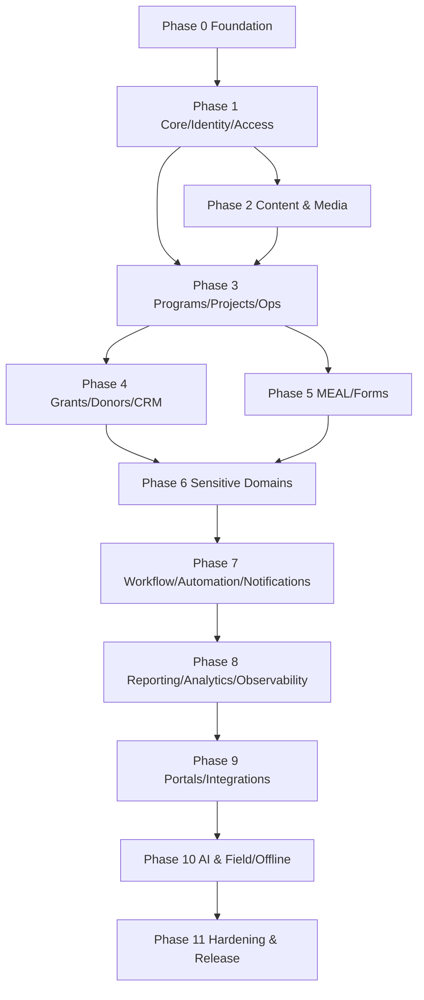

# IMPLEMENTATION_PLAN.md — YNGO-CMS / YemenNGO-CMS

> **Status:** Draft — requires ADR-001..ADR-005 + Q-01..Q-06 approval before Phase 0 may start.
> **Owner:** Lead Architect | **Last Updated:** 2026-10-02
> **Inputs:** PROJECT_AUDIT.md, ARCHITECTURE.md, TECHNICAL_DECISIONS.md, RISK_REGISTER.md, OPEN_QUESTIONS.md
> **Rule:** No code is written until the plan is approved. Every phase has an explicit exit gate.

---

## How to Read This Plan

- **Phases are strictly sequential in their prerequisites** but may overlap in staffing once the gate is passed.
- Each phase lists: **Goal → Scope → Tasks → Deliverables → Exit Gate (DoD)**. A phase is not "done" until its gate passes.
- **V1** = the first deployable release (Phases 0–3 + selected platform services). Later phases extend V1 without breaking contracts.
- Task IDs (`TASK-NNN`) are stable references used in ADRs and the risk register and map to `docs/99-project-management/tasks.md`.
- **Stack throughout:** NestJS + Fastify / Next.js / TypeScript (per ADR-001), Postgres+PostGIS, Redis, MinIO, BullMQ.

---

## Phase 0 — Foundation (BLOCKING)

**Goal:** A runnable, testable, deployable skeleton that every later phase builds on. No business modules yet.

**Scope:**

| Area | Deliverable |
|------|-------------|
| Repo | `git init`, pnpm workspaces `apps/*` + `packages/*`, `.gitignore`, `README.md`, `AGENTS.md` |
| Env | `.env.example` (all required vars documented), env validation on boot, no secrets in repo |
| Compose | `docker-compose.yml` (proxy, web, api, worker, postgres+PostGIS, redis, minio) + health checks |
| API skeleton | NestJS app with global pipes/filters/interceptors, `/health`, `/ready`, OpenAPI at `/api/docs`, request-id + audit plumbing |
| Web skeleton | Next.js App Router + next-intl (ar/en) with RTL `dir`, Tailwind + shadcn, empty-state primitives |
| DB | Migration tool wired; initial migration: `tenant`, `user`, `audit_log` tables + `tenant_id` convention |
| Tenancy | `TenantContext` + `TenantGuard` + tenant-scoped repository base (ADR-004/005) |
| Auth | Session cookie + bearer + refresh rotation skeleton; password hashing; login audit |
| CI | Lint + typecheck + unit tests + secret scan in CI; branch protection |
| Bootstrap | CLI `pnpm bootstrap:org` (ADR-012) |

**Key tasks:** TASK-001 repo + workspaces · TASK-002 env contract · TASK-003 compose · TASK-004 API skeleton · TASK-005 web skeleton · TASK-006 DB + migrations · TASK-007 tenancy primitives · TASK-008 auth skeleton · TASK-009 CI · TASK-010 bootstrap CLI

**Exit gate (DoD):**
- [ ] `docker compose up` brings all services healthy; `/health` and `/ready` pass.
- [ ] `pnpm lint && pnpm typecheck && pnpm test` green in CI.
- [ ] OpenAPI served at `/api/docs` and generated artifact committed or CI-published.
- [ ] Tenant isolation negative test proves cross-tenant read is 403/404.
- [ ] Bootstrap creates first tenant/org/admin without defaults; re-running without token fails.
- [ ] `docs/10-devops/local-development.md` lets a new contributor run the stack from scratch.
- [ ] No `any`, no mock business data, no committed secret — CI enforces.

---

## Phase 1 — Core, Identity & Access

**Goal:** Tenancy, identity, and authorization are production-grade before any business data exists.

**Scope:** Tenancy lifecycle, Identity (users, invitations, sessions, password reset, MFA prep), Access (RBAC `resource:action` catalog, groups, ABAC, API keys), Organization structure, Audit hardening, Admin UI for users/roles/org.

**Exit gate:**
- [ ] Permission catalog covers every Phase 1 route; `@RequirePermissions` on every handler.
- [ ] RBAC + ABAC negative tests for every surface; tenant isolation tests expanded.
- [ ] Invitation + reset + API-key lifecycles fully tested; secrets never returned after creation.
- [ ] Audit log covers every mutation; append-only enforced by DB grants.
- [ ] Admin UI manages users/roles/groups/org with empty/loading/error states and no mock data.

---

## Phase 2 — Content & Media Platform

**Goal:** CMS and media are usable as the content backbone.

**Scope:** Content (pages, articles, news, stories, publications, FAQs, campaigns, categories, tags + publishing workflow), Media/DAM (upload, renditions, folders, collections, `StoragePort` → MinIO), Documents/DMS (versions, categories, retention, classification labels), Search (PG FTS behind `SearchPort`), Workflow tied to content states.

**Exit gate:**
- [ ] Content lifecycle (draft → review → published → archived) only via guarded transitions.
- [ ] Media upload enforces allow-list + magic-byte + size + quarantine + signed URLs.
- [ ] Search is tenant-scoped and permission-filtered; cross-tenant search returns nothing.
- [ ] Restricted docs excluded from public indexes.

---

## Phase 3 — Programs, Projects, Operations

**Goal:** Core NGO operating model is functional end-to-end.

**Scope:** Programs + Activities, Projects (locations, team, milestones + GIS), MEAL (indicators, values, logframes), Grants (milestones, reports, opportunities), Partners/Donors/CRM, Assets/Fleet/Travel/Procurement/Finance (lightweight at V1), Forms, Reporting (async), Notifications + Webhooks, Import/Export.

**Key tasks:** TASK-030 programs + activities · TASK-031 projects + milestones ·
TASK-032 project locations (GIS) · TASK-033 reporting engine (async) ·
TASK-034 webhooks + delivery log · TASK-035 notifications baseline ·
TASK-036 import/export baseline.

**Exit gate:**
- [ ] Program → project → milestone → indicator → report chain works with real data.
- [ ] Queues are durable (BullMQ) and visible in admin.
- [ ] Report generation is async with progress; exports audited and rate-limited.
- [ ] Project locations render on MapLibre; restricted locations excluded from public layers.

---

## Phase 4 — Grants, Donors, Partners & CRM

**Goal:** Funding and relationship management works end-to-end over real records.

**Scope:** Grants (lifecycle, milestones, grant reports, opportunities, proposals),
Donors (profiles, due diligence, funding links), Partners (profiles, MoUs,
relationships), Stakeholders/CRM (contacts, interactions, meetings, calls, CRM
tasks, follow-ups), Communications-lite (media room, press releases), Events
(registration, attendance, certificates).

**Key tasks:** TASK-040 grants core · TASK-041 grant milestones + reports ·
TASK-042 donors · TASK-043 partners + MoU · TASK-044 CRM interactions ·
TASK-045 events · TASK-046 notifications wiring for deadlines.

**Exit gate:**
- [ ] Grant → milestone → report → donor linkage persists and is queryable.
- [ ] Deadline automations produce real notifications; no fake activity feed.
- [ ] CRM interactions are append-only with actor + timestamp.
- [ ] Relationship/partner data is tenant-scoped and permission-filtered.

---

## Phase 5 — MEAL, Forms & Surveys

**Goal:** Measurement, data collection, and evidence become first-class.

**Scope:** MEAL (logframes, indicators, indicator values, baselines, assessments,
evaluations), Results reporting, Forms engine (reusable field schema, conditional
logic, validation, uploads, submissions, review workflow, exports), Survey
submission via public/API with rate limiting, Data Quality (duplicates, missing
fields, review queue), Import (CSV/XLSX/JSON with mapping → preview → confirm →
report).

**Key tasks:** TASK-050 logframe + indicators · TASK-051 indicator values +
aggregation · TASK-052 form schema engine · TASK-053 submissions + review ·
TASK-054 import pipeline · TASK-055 data-quality rules.

**Exit gate:**
- [ ] Indicator values aggregate correctly per reporting period with audit trail.
- [ ] Forms support schema versioning; old submissions remain readable.
- [ ] Import is validate-then-commit with partial-failure reporting.
- [ ] No fabricated measurements anywhere; empty projects show honest empty states.

---

## Phase 6 — Sensitive Domains (People, Cases, Safeguarding, Complaints, GIS)

**Goal:** Privacy-critical modules delivered with stricter-than-default controls.

**Scope:** Beneficiaries/Households/Enrollment/Assistance/Referral, Case Management
(lifecycle + notes + assessments + follow-ups), Safeguarding (restricted cases,
incidents, investigators, controlled exports), Complaints/Feedback (public intake,
anonymous option, triage, escalation, resolution), Volunteers (skills,
assignments, hours, certificates), HR/People-lite (records, contracts, leave,
training; payroll = integration only), Membership, Governance (boards, committees,
resolutions, policies), GIS (PostGIS layers, project maps, public/private layer
policy).

**Key tasks:** TASK-060 beneficiaries + field-level policy · TASK-061 cases ·
TASK-062 safeguarding + separate audit · TASK-063 complaints · TASK-064 volunteers
+ membership · TASK-065 governance · TASK-066 GIS layers + privacy rules.

**Exit gate (highest scrutiny):**
- [ ] Field-level policy denies restricted fields even when the record is readable.
- [ ] Unauthorised users cannot query, filter, export, or search beneficiary/case/
      safeguarding records — proven by negative tests per surface.
- [ ] Safeguarding rows never appear in generic search or exports.
- [ ] Sensitive coordinates never appear in public GIS layers.
- [ ] Every sensitive access/export is audited with actor + reason.

---

## Phase 7 — Workflow, Automation, Notifications & MFA

**Goal:** Configurable processes and alerting replace manual coordination.

**Scope:** Workflow engine (versioned definitions, steps, transitions, conditions,
assignments, approvals, escalation, SLA, timers), Automation engine
(trigger → conditions → actions, permission-aware + rate-limited, execution log),
Notification Center (in-app, email, SMS, push, webhook channels, tenant-aware
localized templates, preferences, delivery attempts), MFA (TOTP), Security
hardening (headers, CSRF, CSP, rate-limit tightening).

**Key tasks:** TASK-070 workflow engine · TASK-071 approval/escalation ·
TASK-072 automation rules · TASK-073 notification center + templates ·
TASK-074 MFA · TASK-075 security headers + CSRF/CSP.

**Exit gate:**
- [ ] Status cannot be changed except through guarded workflow transitions.
- [ ] Workflow definitions are versioned; in-flight instances keep their version.
- [ ] Automation executions are logged and cannot exceed actor permissions.
- [ ] Notifications deliver through real providers with retry + delivery log.
- [ ] MFA enrol/verify/recovery works and is audited.

## Phase 8 — Reporting, Dashboards, Analytics & Observability

**Goal:** Decision-support and operational visibility over real data only.

**Scope:** Reporting engine v2 (templates, parameterized reports, charts, maps,
tables, snapshots, async generation, PDF/HTML/CSV/XLSX export), Analytics (KPI
engine, portfolio/funding/geographic/trend analysis, drill-down, saved views),
Dashboard builder (widgets: KPI, number, chart, table, map, progress, timeline,
activity feed; permission + tenant aware), Observability (metrics, tracing,
error-reporting adapter, SLO dashboards, alerting thresholds), Search v2
(facets, Arabic tokenization tuning, cross-entity search).

**Key tasks:** TASK-080 report templates + async runs · TASK-081 exports ·
TASK-082 KPI + analytics queries · TASK-083 dashboard builder ·
TASK-084 metrics + tracing · TASK-085 search facets + Arabic tuning.

**Exit gate:**
- [ ] Every widget/report is permission- and tenant-aware (verified by negative tests).
- [ ] Charts read from real queries; empty data renders honest empty states.
- [ ] Metrics expose latency/error/queue/DB health; `/ready` reflects dependencies.
- [ ] Report jobs are durable, cancellable, and audited.

---

## Phase 9 — Portals, Integrations & Developer Platform

**Goal:** External surfaces and integrations use the same API and permissions.

**Scope:** Public website (pages, news, projects, impact, publications, events,
vacancies, tenders, contact — all from the API), Partner/Donor/Applicant/Volunteer/
Member/Board portals with independent route guards, Developer portal (OpenAPI,
auth guide, API keys, webhooks, SDK docs, rate limits, error codes, changelog),
TypeScript/Python SDK generation, Integrations (M365, Google Workspace, Teams,
Slack, email/SMS/WhatsApp/Telegram, accounting, storage, IdP, GIS, payments) behind
adapters, Microsites + theme engine + white-label (design tokens).

**Key tasks:** TASK-090 public site · TASK-091 portals + guards ·
TASK-092 developer portal + SDK generation · TASK-093 integration adapters ·
TASK-094 theme engine + white-label.

**Exit gate:**
- [ ] Public pages are ISR/SSR with correct `hreflang` and RTL for `ar`.
- [ ] Every portal enforces its own guard and shares domain services (no duplicate logic).
- [ ] SDKs are generated from OpenAPI in CI (never hand-maintained).
- [ ] Integration adapters are swappable and failure-isolated.

## Phase 10 — Optional AI & Field/Offline

**Goal:** Bounded AI assistance and genuine offline capability — both opt-in.

**Scope:** AI platform (provider/model registry, `AiPort`, request/job entities,
translation, summarisation, classification, document extraction, content
assistance, knowledge search, reporting assistance) under ADR-014 governance
(draft → human review → approval → recorded; no silent overwrite; redaction/privacy
routing), optional FastAPI sidecar for OCR/NLP/embeddings, AI evaluation harness
(datasets, metrics, thresholds, regression tests), Field PWA (offline forms/local
store, queue, retry, sync engine, conflict resolution, GPS capture, local
encryption) — real sync only, never faked.

**Key tasks:** TASK-100 AI port + registry · TASK-101 AI governance + review UI ·
TASK-102 AI evaluation harness · TASK-103 Python sidecar · TASK-104 field offline
store + sync · TASK-105 conflict resolution + local encryption.

**Exit gate:**
- [ ] AI output is always a draft requiring explicit human approval.
- [ ] AI inherits caller permissions and never broadens them (negative tests).
- [ ] Evaluation thresholds gate AI feature enablement.
- [ ] Offline sync resolves conflicts deterministically and never loses accepted data.

---

## Phase 11 — Production Hardening & Release

**Goal:** A release an NGO can actually run in production.

**Scope:** Performance (query budgets, index review, N+1 elimination, caching,
load test), Security (threat-model review, dependency scan, penetration checklist,
secret rotation drill), Reliability (backup/restore rehearsal, DR test, failover
runbook), Operations (runbook, alerting, on-call checklist, upgrade procedure),
Compliance (data-retention + privacy matrix, access reviews, export/deletion
workflows, audit reporting), Documentation finalisation + release notes +
versioning.

**Key tasks:** TASK-110 performance pass · TASK-111 security review ·
TASK-112 backup/restore + DR drill · TASK-113 runbook + on-call ·
TASK-114 compliance artefacts · TASK-115 release + changelog.

**Exit gate:**
- [ ] Load test meets SLOs (API p95 < 300 ms; search p95 < 500 ms) at target scale.
- [ ] Restore-from-backup verified on a clean environment within the documented RTO.
- [ ] No Critical/High risk remains OPEN without a signed ADR acceptance.
- [ ] All documentation sets are current and cross-linked.
- [ ] Release notes + version tag + migration instructions published.

---

## Task Breakdown Convention

Every task in `docs/99-project-management/tasks.md` uses this template:

```text
TASK-NNN — <title>
Phase:          <n>
Goal:           <one sentence outcome>
Context:        <why it exists; links to ARCHITECTURE / domain / API docs>
Dependencies:   <TASK-IDs that must be complete>
Files:          <expected paths touched>
Implementation: <precise steps, no ambiguity>
Acceptance:     <testable criteria>
Tests:          <unit / integration / authz / tenant-isolation / E2E>
Validation:     <exact commands, e.g. pnpm --filter api test>
Do not:         <guardrails for this task>
```

## Dependency Graph



**V1 scope** = Phase 0 → 3 (plus Tenancy, Identity, Access, Media, Search, Audit).
Phases 4–11 extend V1 without breaking API contracts.

## Definition of Done (applies to every task)

```text
[ ] Requirement implemented and traceable to a spec/ADR
[ ] Types pass (no `any` in domain code)
[ ] Lint + format pass
[ ] Unit tests written and passing
[ ] Integration tests passing
[ ] Authorization test added/updated (deny-by-default proven)
[ ] Tenant-isolation test added/updated where data is involved
[ ] E2E flow passing where applicable
[ ] Error handling implemented with stable error codes
[ ] Structured logging + request_id present
[ ] Audit event emitted for mutations
[ ] Documentation updated (docs/, OpenAPI regenerated)
[ ] Migration tested (forward + rollback) where schema changed
[ ] No mock/demo/fake data in runtime code
[ ] No secrets, no hard-coded tenant/domain values
[ ] git diff reviewed; no unrelated changes
```

## Phase Sizing (indicative, not a commitment)

| Phase | Focus | Relative size |
|-------|-------|---------------|
| 0 | Foundation | S |
| 1 | Core / Identity / Access | M |
| 2 | Content & Media | M |
| 3 | Programs / Projects / Ops | L |
| 4 | Grants / Donors / CRM | M |
| 5 | MEAL / Forms | L |
| 6 | Sensitive Domains | L |
| 7 | Workflow / Automation | L |
| 8 | Reporting / Observability | M |
| 9 | Portals / Integrations | L |
| 10 | AI & Field/Offline | L (optional) |
| 11 | Hardening / Release | M |

## Approval Gate

Phase 0 may not begin until:
1. ADR-001, ADR-003, ADR-004, ADR-005, ADR-009, ADR-012 are moved to `ACCEPTED`.
2. Q-01 … Q-06 are answered in `OPEN_QUESTIONS.md`.
3. `AGENTS.md` is reviewed and adopted as the execution contract.

*End of IMPLEMENTATION_PLAN.md*


