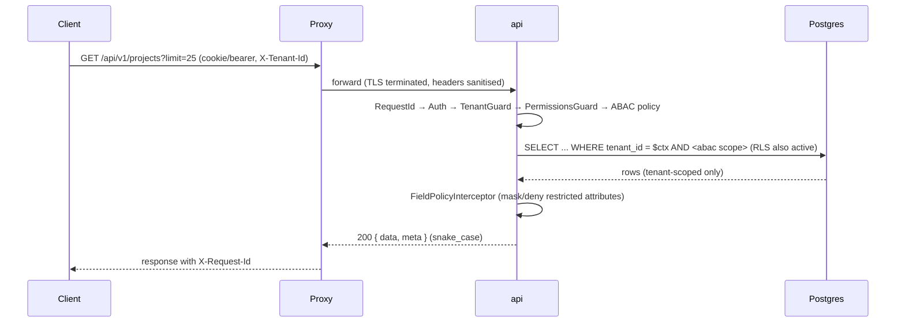

# docs/03-architecture/data-flow.md

> **Status:** Current (design) — implementation `PLANNED` | **Owner:** Lead Architect
> **Last Updated:** 2026-10-02 | **Source:** `ARCHITECTURE.md` §7–§10; ADR-004/008/009/010
> **Purpose:** end-to-end flows showing where tenant, permission, audit, and
> transaction boundaries apply.

## 1. Standard Request Flow (read)



Invariants: the tenant predicate is applied by the repository base and mirrored by
RLS; denial is 403 for missing permission and 404 for foreign-tenant ids; list
responses carry `meta` pagination only.

## 2. Mutation Flow (create/update with audit)

```text
POST/PATCH /api/v1/<resource>
  1  ValidationPipe (DTO, whitelist, forbidNonWhitelisted)          → 422 on failure
  2  Guards: auth → tenant → permission → ABAC scope                → 403 on failure
  3  BEGIN TRANSACTION
  4     domain invariant checks (business rules BR-*)
  5     repository write (tenant-scoped)
  6     audit.audit_log INSERT (actor, before/after, request_id)     ← same transaction
  7     domain event emitted (outbox-style, for projections/automation)
  8  COMMIT
  9  ResponseMapper → 200/201
 10  Post-commit side effects enqueued (search indexing, notifications, webhooks)
```

Invariants: audit cannot drift from the change (same transaction, BR-005); a failed
invariant rolls back both write and audit; side effects are **after** commit so a
notification never describes a change that did not persist.

## 3. Content Publish Flow

```text
Editor saves draft            → content_version INSERT + audit + search index (draft excluded)
Editor submits                → workflow transition Draft → InReview (guarded, audited)
Approver decides              → Approved | ChangesRequested (four-eyes where configured)
Approver publishes            → status Published (guard: approved revision exists, BR-020)
    → projection: search_document indexed as public
    → web revalidation triggered (ISR) for the affected path(s)
    → notification/webhook emitted (after commit)
Public request /public/content/...  → served from cache; only Published rows reachable
```

Failure behaviour: if revalidation or indexing fails, the publish itself stays
committed and the projection is rebuilt by the `search-index` queue — the failure is
visible in the admin console, never silently swallowed.

## 4. Async Job Flow (report, export, import)

```text
Client: POST /reports/run
  → permission checked at creation (BR-073) → report_run row (status queued)
  → job enqueued on `reports` with { tenant_id, request_id, report_run_id, params }
Worker:
  → hydrate tenant + request context from the payload
  → load permissions held by the requesting actor at run time (no superuser reads)
  → build artifact → store via StoragePort
  → update report_run status + progress → audit record
Client: GET /reports/runs/{id}/download
  → permission checked AGAIN at download (BR-073) → short-lived signed URL (audited)
```

Import is **validate-then-commit**: the worker validates every row, writes
`import_row` results, then commits only valid rows — a partial failure never leaves
committed rows corrupted (`BR-071`/`BR-072`), and the error report lists failures
per row.

## 5. File Upload and Download Flow

```text
POST /media (multipart)
  1  size limit check                                   → UPLOAD_TOO_LARGE
  2  extension allow-list + magic-byte detection         → UPLOAD_TYPE_NOT_ALLOWED
  3  store to quarantine prefix via StoragePort (server-generated key)
  4  virus scan (AntivirusPort; no-op is logged, not silent)
  5  metadata row INSERT (status quarantined|clean) + audit
  6  renditions queued (`renditions`)
Download: GET /media/{id}/signed-url → permission re-check → short-lived URL (audited)

Rule: object paths are never public; a metadata row never exists without a stored
object, and an object is never served without a metadata row and a permission check.
```

## 6. Search Flow

```text
Write path:  domain event (after commit) → search-index queue
             → owner module supplies a permission-scoped projection
             → SearchPort.index(search_document with permission_scope)

Read path:   GET /search → SearchPort.search({ q, filters, tenantId, permissionScope })
             → results filtered by tenant + caller's permission scope BEFORE returning
             → restricted/sensitive entities are never indexed (BR-062)

Rebuild:     POST /search/reindex → queue job → deterministic rebuild from source
             (projections are always rebuildable; they are never authoritative)
```

## 7. Webhook and Notification Flow

```text
Domain event committed → notification/webhook rows + queue jobs (tenant_id, request_id)
Worker → NotifierPort.send(...) / signed HTTP POST (HMAC + timestamp)
  attempt 1 ─┐
  attempt 2 ─┤ exponential backoff (jittered)
  attempt n ─┘ → dead-letter + visible in admin, with attempt log and response status
Rules: every attempt recorded (BR-083/BR-084); repeated failure auto-disables the
endpoint rather than retrying forever; payloads contain only the fields the event
declares — never a full entity dump.
```

## 8. AI Flow (optional, Phase 10)

```text
Actor requests an AI capability (POST /ai/requests)
  → permission check (actor's permissions inherited, BR-091)
  → privacy filter: sensitive data redacted or blocked (BR-094)
  → AiPort.request(...) → sidecar (no canonical-store write access)
  → ai_request/ai_response recorded (provider, model, prompt version, actor)
  → result returned as a DRAFT
Human review → POST /ai/responses/{id}/review
  → approved ⇒ the reviewing actor's normal mutation path writes the record
  → rejected ⇒ draft discarded; nothing is silently overwritten (BR-092)
```

## 9. Cross-Flow Invariants

```text
[ ] tenant context established before any data access and immutable thereafter
[ ] audit written in the same transaction as the mutation
[ ] post-commit side effects are queued, idempotent, and observable
[ ] every exported/sensitive read is permission-checked, rate-limited, and audited
[ ] rejected/denied attempts produce a security event with the same request_id
[ ] nothing in a job payload or webhook body exceeds the minimum needed fields
```

## Related

- Root architecture: `../../ARCHITECTURE.md` §7, §10
- Security enforcement points: `security.md` · Context: `system-context.md`
- Tenancy decisions: `../13-decisions/ADR-0004-tenancy-isolation.md`

*End of docs/03-architecture/data-flow.md*