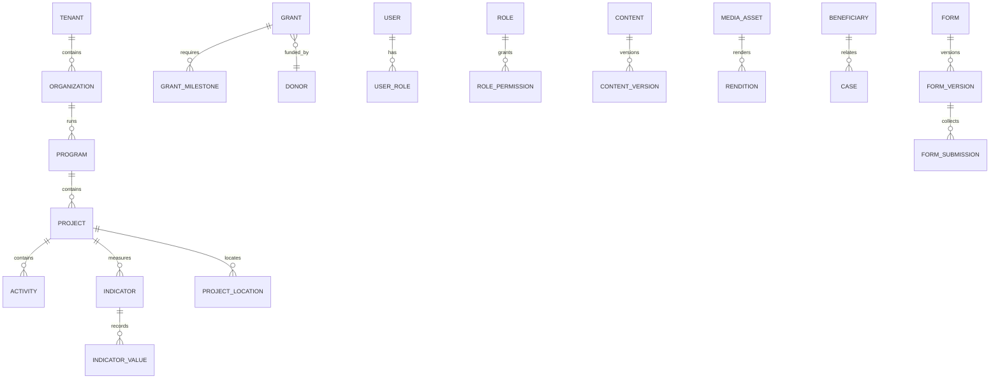

# docs/04-data/database.md

> **Status:** Current | **Owner:** DB Architect | **Last Updated:** 2026-10-02
> **Source:** Technical_Architecture_Instructions §7–§8; Eng_Package §DB; ADR-003/004
> **Purpose:** canonical data platform design. Schema detail lives in `schema.md`.

## Canonical Store

**PostgreSQL + PostGIS** is the single source of truth for all transactional and
geospatial data. Redis and object storage are rebuildable infrastructure and MUST
NOT hold data that cannot be regenerated.

## Extensions and Capabilities

```text
postgis          geospatial types, indexes, functions
pgcrypto         gen_random_uuid()
pg_trgm          fuzzy matching for search
unaccent         Arabic diacritic-insensitive matching (strategy in docs/05-api)
```

## Schema Organisation

```text
public      all application tables (tenant-scoped by tenant_id)
audit       audit_log (append-only, restricted grants)
geo         locations, boundaries, map layers (PostGIS)
```

## Tenancy Model (ADR-004)

- Shared schema. Every tenant-owned table carries `tenant_id uuid NOT NULL`
  with FK to `tenant(id)` and an index whose **first column is `tenant_id`**.
- Application access goes through a tenant-scoped repository base; modules never
  use an unrestricted entity manager.
- PostgreSQL **Row-Level Security** is enabled as defence-in-depth on
  tenant-owned tables, keyed off a session variable set per transaction.
- Platform-global tables omit `tenant_id`; each such omission is listed here.

### Platform-global tables (intentional `tenant_id` omission)

```text
tenant, tenant_settings, tenant_domain
permission (catalog), master_data_entry, currency, country, governorate, district
integration_provider (catalog), notification_channel_config (defaults only)
ai_provider, ai_model, ai_prompt_version
```

## Indexing Strategy

| Purpose | Index |
|---------|-------|
| Tenant scoping | `(tenant_id, id)`, and `(tenant_id, <hot filter>)` on list queries |
| Business keys | unique `(tenant_id, slug)` for content; `(tenant_id, code)` for reference data |
| Search | GIN on `tsvector`; GIN `pg_trgm` for fuzzy fallback |
| Geospatial | GiST on `geometry`/`geography` columns |
| Relationships | btree on every FK (`(tenant_id, fk_id)`) |
| Soft delete | partial index `WHERE deleted_at IS NULL` for hot tables |
| Audit | btree on `(tenant_id, created_at DESC)`, `(entity_type, entity_id)` |
| Time series | btree on `(tenant_id, indicator_id, period_id)` |

## Constraints

- `NOT NULL` on all tenant scoping and audit columns.
- `FOREIGN KEY` on every relationship; `ON DELETE RESTRICT` by default,
  `CASCADE` only for true composition (e.g. `content_version` → `content`).
- `UNIQUE` where business rules require (codes, slugs, emails per tenant).
- `CHECK` constraints for enums, ranges (percentages, amounts ≥ 0), and dates
  (`end_date >= start_date`).
- JSONB only for genuinely schema-variable data (custom fields, form schemas,
  workflow conditions) — validated by a schema on write.

## Transactions and Concurrency

- Every mutation runs inside an explicit transaction; audit is written in the
  same transaction so it cannot drift from the change.
- Optimistic concurrency (`updated_at` or `version` column) on entities subject to
  concurrent editing (content, projects, forms).
- Advisory locks or `SELECT ... FOR UPDATE` for state transitions (workflow,
  approvals, stock movements).
- Connection pooling (PgBouncer) once replica/scale-out is needed.

## Migrations

- Append-only, ordered, reproducible; tool per **ADR-003** (TypeORM migrations).
- Each migration has a tested down/rollback path.
- Migrations run as a one-shot step before application rollout.
- Back up before destructive/irreversible changes; destructive changes require an ADR.
- Naming: `NNNN-<verb>-<subject>` (e.g. `0007-create-projects`).

## Soft Delete vs Archival

Soft delete (`deleted_at`) is used **only** where the business genuinely needs to
retain hidden rows (e.g. content authorship history, financial references).
Otherwise use hard delete + audit record + (where required) an archive table.

Never use soft delete as a substitute for a proper archival or retention policy.

## Audit Schema (append-only)

```text
audit.audit_log
  id            uuid        PK
  tenant_id     uuid        NULL for platform-level events
  actor_id      uuid        NULL for system actions
  action        text        e.g. project.updated
  entity_type   text
  entity_id     uuid
  old_value     jsonb       redacted to policy
  new_value     jsonb       redacted to policy
  ip_address    inet
  user_agent    text
  request_id    text
  created_at    timestamptz NOT NULL
```

Rules: no `UPDATE`/`DELETE` grants; retained per data-governance policy; readable
only through an authorized audit endpoint; sensitive values redacted per
classification.

## Sensitive Data Handling

| Class | Examples | Handling |
|-------|----------|----------|
| public | published content, public projects | readable without auth |
| internal | programs, donors, partners, tasks | authenticated tenant members |
| confidential | budgets, contracts, staff records | permission-gated + audited export |
| restricted | cases, referrals, complaints | strict permission + field-level policy |
| sensitive | beneficiaries, safeguarding, personal locations | strictest policy, pseudonymous ids where possible, no public GIS, separate audit |

## Backup and Recovery

```text
Continuous   WAL archiving (point-in-time recovery)
Daily        logical or physical base backup
Weekly       full backup + verification
Off-site     encrypted copy to independent location
Objects      versioning on the bucket; lifecycle per retention policy
Restore      documented drill; RTO/RPO recorded in docs/12-operations/runbook.md
```

Backup health and last-success are surfaced in the admin console.

## Data Quality

Detect and review: duplicates, missing required fields, invalid values,
conflicting records, stale records, inconsistent references. A quality score and
review queue back controlled merges, which always require explicit human
confirmation and produce a full audit trail.

## Entity Relationship Overview



*For the complete per-table field specification see `docs/04-data/schema.md`;
for migration history see `docs/04-data/migrations.md`.*

## Related

- Schema detail: `docs/04-data/schema.md`
- Migrations: `docs/04-data/migrations.md`
- Domain model: `docs/02-domain/domain-model.md`
- Security: `docs/11-security/security.md`